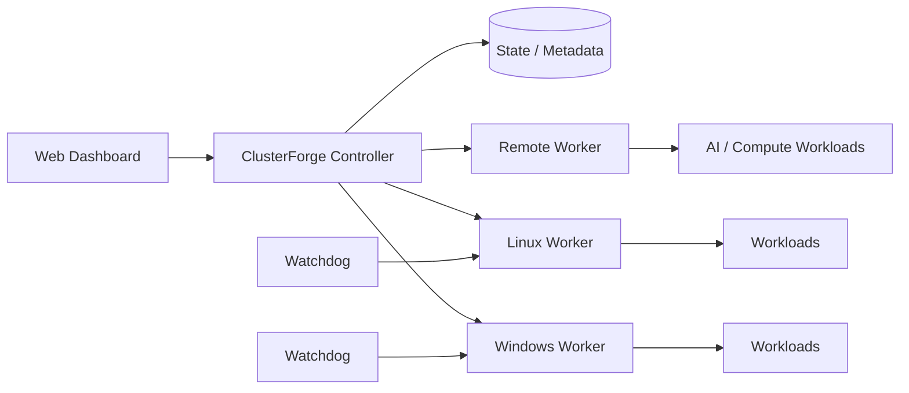

# ClusterForge

> Distributed compute and workload orchestration for heterogeneous Windows and Linux nodes.

[](https://github.com/Bradock213/GommeGames/actions/workflows/build-clusterforge.yml)

ClusterForge is a solo-developed infrastructure project for centrally managing distributed compute resources. It combines a controller, workers/agents, watchdog processes and a browser-based dashboard to provision, monitor and operate workloads across multiple machines and networks.

The project is currently an **MVP in active development**. The focus is reliable orchestration, automation, resource-aware scheduling and a foundation for AI/compute workloads.

## What ClusterForge solves

Managing several Windows and Linux machines individually quickly becomes difficult: each node needs its own setup, monitoring, process management and recovery logic. ClusterForge provides a single control plane for those systems.

The goal is to make heterogeneous compute nodes behave like one manageable cluster while keeping workloads isolated and observable.

## Current MVP capabilities

- Central controller and browser-based management dashboard
- Windows and Linux worker/node support
- Node pairing and authenticated controller/worker communication
- Hardware and health metrics
- Resource-aware workload scheduling and node selection
- Generic workload lifecycle: start, stop, restart and crash handling
- Console/log access and workload status reporting
- File transfer, provisioning and migration workflows
- Watchdog-based recovery for ClusterForge services
- Synchronization and failover-related workload lifecycle logic
- AI/compute workload lifecycle foundations
- Windows x86-64 native worker and watchdog builds with CI smoke tests

## Architecture



The controller acts as the control plane. Workers connect to it and expose resources and workload capabilities. The dashboard is used to monitor nodes and operate workloads from one place.

## Repository status

This repository currently contains compact build inputs and reproducible CI tooling for parts of the ClusterForge MVP, including the native Windows worker/watchdog build pipeline.

```text
.github/workflows/   GitHub Actions build and smoke-test workflows
build-input/         Compact ClusterForge build inputs
windows-build/       Native Windows worker build inputs
```

The Windows CI pipeline reconstructs the native source, compiles `ClusterForgeWorker.exe` and `ClusterForgeWatchdog.exe`, runs smoke tests, generates SHA-256 checksums and packages the result as a ZIP artifact.

## Development stage

**Stage:** MVP / early-stage development  
**Team:** Solo developer  
**Primary focus:** distributed orchestration, reliability, automation and AI/compute infrastructure

ClusterForge is not presented as production-ready yet. Current development is focused on improving deployment, observability, cluster reliability, scaling and real-world multi-node testing.

## Roadmap

See [ROADMAP.md](ROADMAP.md) for the current development direction.

Near-term priorities include:

- reproducible controller and worker deployments
- stronger observability and diagnostics
- larger multi-node test environments
- improved failover and synchronization behavior
- containerized workload support
- AI/compute workload orchestration
- public documentation and versioned releases

## Builds and releases

Pull requests can trigger the Windows worker build workflow. Build artifacts contain the native worker, watchdog, install/uninstall scripts, test documentation and SHA-256 checksums.

Versioned public releases are being introduced as the MVP stabilizes.

## Security

Please do not publish credentials, API keys, pairing secrets or private infrastructure information in issues or commits. Security-related reports should be handled privately until a dedicated disclosure process is published.

## Project background

ClusterForge started as a practical way to coordinate multiple computers and workloads from one control plane. It is being expanded into a more general distributed compute platform suitable for self-hosted infrastructure, automated workloads and AI/compute experimentation.

---

**ClusterForge is under active development. APIs, deployment procedures and internal formats may change before a stable release.**
