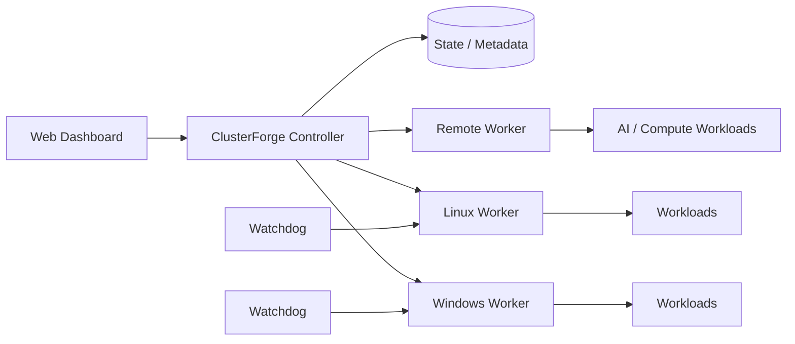

# ClusterForge

<div align="center">

**Distributed compute orchestration for heterogeneous Windows and Linux nodes.**

[](https://github.com/Bradock213/ClusterForge/actions/workflows/build-clusterforge.yml)
[](https://github.com/Bradock213/ClusterForge/releases)
[](https://github.com/Bradock213/ClusterForge/releases)


[Download MVP](https://github.com/Bradock213/ClusterForge/releases/tag/v0.1.0-mvp) · [Roadmap](ROADMAP.md) · [Architecture](docs/ARCHITECTURE.md) · [Changelog](CHANGELOG.md) · [Security](SECURITY.md) · [Contributing](CONTRIBUTING.md)

</div>

ClusterForge is a solo-developed control plane for coordinating distributed compute resources across heterogeneous machines. It combines a central controller, browser-based dashboard, workers/agents and watchdog processes to provision, monitor and operate workloads from one place.

The project is currently an **active MVP**. Current development focuses on reliable orchestration, resource-aware scheduling, recovery, automation and a foundation for AI/compute workloads.

> **Current public release:** `v0.1.0-mvp` contains the native Windows x86-64 worker/watchdog package. The complete platform is still being hardened and documented for broader use.

## Why ClusterForge?

ClusterForge is aimed at a different gap than container-only platforms or Python-only distributed runtimes: coordinating ordinary heterogeneous computers and generic workloads through one lightweight control plane.

| Focus | ClusterForge approach |
|---|---|
| Heterogeneous nodes | Windows and Linux worker/node support |
| Central operations | Browser-based dashboard and controller |
| Workload lifecycle | Start, stop, restart, status and crash handling |
| Scheduling | Hardware/resource-aware node selection |
| Resilience | Watchdog recovery and failover-related lifecycle logic |
| Observability | Hardware/health metrics, logs and workload status |
| Deployment direction | Self-hosted, remote nodes, containers and cloud environments |
| Compute direction | General workloads plus AI/compute orchestration foundations |

## Current MVP capabilities

- central controller and browser-based management dashboard
- Windows and Linux worker/node support
- authenticated node pairing and controller/worker communication
- hardware and health metrics
- resource-aware workload scheduling and node selection
- generic workload lifecycle: start, stop, restart and crash handling
- console/log access and workload status reporting
- file transfer, provisioning and migration workflows
- watchdog-based recovery for ClusterForge services
- synchronization and failover-related workload lifecycle logic
- AI/compute workload lifecycle foundations
- reproducible Windows x86-64 worker/watchdog CI builds with smoke tests and SHA-256 checksums

## Architecture



The controller acts as the control plane. Workers connect to it, report capabilities and expose workload operations. The dashboard provides a single place to observe nodes and control workloads.

More detail: **[docs/ARCHITECTURE.md](docs/ARCHITECTURE.md)**

## Quick start: public Windows worker MVP

The current public release is the Windows worker/watchdog package rather than the full production platform.

1. Download `ClusterForge-Windows-Worker-x64.zip` from the [v0.1.0-mvp release](https://github.com/Bradock213/ClusterForge/releases/tag/v0.1.0-mvp).
2. Extract the archive on a Windows x86-64 machine.
3. Read the included `TESTING.txt` before installation.
4. Review `install-worker.ps1` before running it and use the package only in an environment you control.
5. Verify the included `SHA256.txt` checksums when testing release binaries.

The release is built automatically in GitHub Actions. The pipeline reconstructs the native source, compiles the worker and watchdog, runs smoke tests, generates checksums and packages the result.

## Where ClusterForge fits

ClusterForge does **not** claim to replace mature projects such as Kubernetes/K3s, HashiCorp Nomad or Ray today. Those projects solve adjacent problems at much greater production maturity.

ClusterForge is being developed around a narrower goal: **make mixed Windows/Linux machines easier to turn into one manageable pool for generic, automated and compute-oriented workloads without requiring every workload to start as a Kubernetes deployment or Python application.**

That positioning keeps the project focused while the MVP grows toward stronger container support, AI scheduling, cloud deployment and multi-node reliability.

## Development status

| Area | Status |
|---|---|
| Controller / worker architecture | MVP |
| Web management dashboard | MVP |
| Windows worker/watchdog | Public MVP release |
| Linux worker/node support | MVP |
| Resource-aware scheduling | MVP |
| Logs / metrics / health | MVP |
| File transfer / provisioning | MVP |
| Failover-related lifecycle logic | Experimental / MVP |
| Container workload support | Planned / in development |
| AI/compute orchestration | Foundation / in development |
| Production hardening | In progress |

## Repository layout

```text
.github/workflows/   CI, smoke-test and release automation
build-input/         Compact ClusterForge build inputs
windows-build/       Native Windows worker build inputs
docs/                Architecture and project documentation
README.md             Project overview and positioning
ROADMAP.md            Public development direction
CHANGELOG.md          Public release history
SECURITY.md           Security reporting guidance
CONTRIBUTING.md       Contribution workflow
```

## Releases and CI

Every Windows worker build reconstructs the compact native source, compiles `ClusterForgeWorker.exe` and `ClusterForgeWatchdog.exe`, runs smoke tests and packages the result. Versioned releases additionally publish the ZIP through GitHub Releases.

Current release: **[ClusterForge v0.1.0-mvp](https://github.com/Bradock213/ClusterForge/releases/tag/v0.1.0-mvp)**

## Roadmap

Near-term priorities include:

- reproducible controller and worker deployments
- stronger observability and diagnostics
- larger real-world multi-node test environments
- improved synchronization and failover behavior
- containerized workload support
- AI/compute workload orchestration
- clearer public documentation and versioned releases

See **[ROADMAP.md](ROADMAP.md)** for the longer development direction.

## Contributing

ClusterForge is currently a solo-developed MVP, but focused bug reports, reproducible test results and clearly scoped contributions are welcome. See **[CONTRIBUTING.md](CONTRIBUTING.md)**.

## Security

Do not publish credentials, API keys, pairing secrets or private infrastructure information in issues or commits. See **[SECURITY.md](SECURITY.md)** for reporting guidance.

---

**ClusterForge is under active development. APIs, deployment procedures and internal formats may change before a stable release.**
