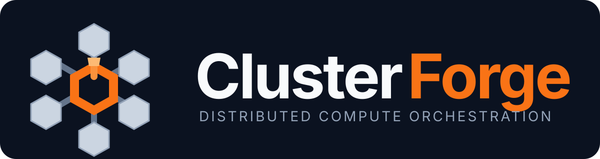
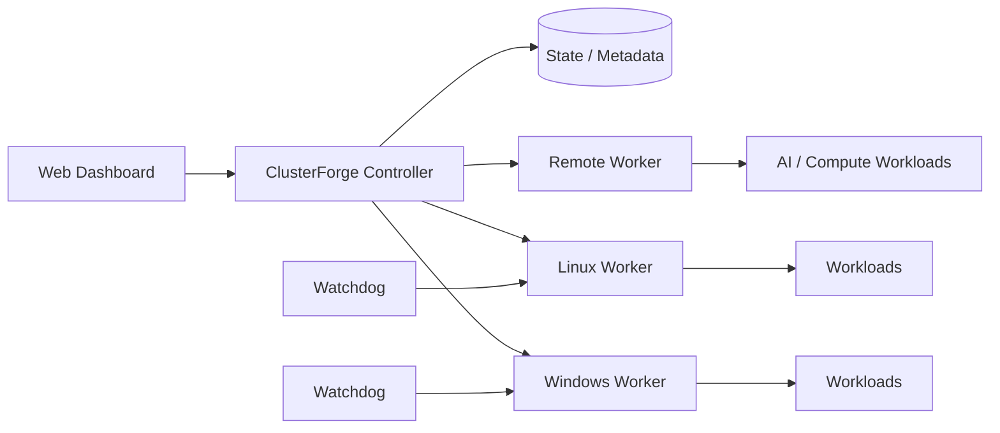

<div align="center">



<br />

**A lightweight control plane for coordinating heterogeneous Windows and Linux compute nodes.**

[](https://github.com/Bradock213/ClusterForge/actions/workflows/build-clusterforge.yml)
[](https://github.com/Bradock213/ClusterForge/releases)
[](https://github.com/Bradock213/ClusterForge/releases)
[](LICENSE)


[**Download MVP**](https://github.com/Bradock213/ClusterForge/releases/tag/v0.1.0-mvp) · [Roadmap](ROADMAP.md) · [Architecture](docs/ARCHITECTURE.md) · [Release policy](docs/RELEASES.md) · [Changelog](CHANGELOG.md) · [Security](SECURITY.md) · [Support](SUPPORT.md)

</div>

---

ClusterForge is a solo-developed distributed-compute orchestration project for turning mixed machines into one manageable pool. A central controller, browser-based dashboard, workers/agents and watchdog processes coordinate workloads across heterogeneous nodes while exposing health, resource and lifecycle information from one place.

The project is currently an **active MVP**. Development is focused on reliable orchestration, resource-aware scheduling, recovery, automation, multi-node operation and a foundation for broader AI/compute workloads.

> **Current public release:** `v0.1.0-mvp` provides the native Windows x86-64 worker/watchdog package. It is automatically compiled, smoke-tested, checksummed and published by GitHub Actions.

## Why ClusterForge?

Many orchestration systems begin with containers, Kubernetes primitives or a language-specific distributed runtime. ClusterForge is being designed around a different starting point: **ordinary heterogeneous computers and generic workloads**.

| Focus | ClusterForge approach |
|---|---|
| Heterogeneous nodes | Windows and Linux worker/node support |
| Central operations | Browser-based dashboard and controller |
| Workload lifecycle | Start, stop, restart, status and crash handling |
| Scheduling | Hardware/resource-aware node selection |
| Resilience | Watchdog recovery and failover-related lifecycle logic |
| Observability | Hardware/health metrics, logs and workload status |
| Deployment direction | Self-hosted, remote nodes, containers and cloud environments |
| Compute direction | General workloads plus AI/compute orchestration foundations |

## Current MVP capabilities

- central controller and browser-based management dashboard
- Windows and Linux worker/node support
- authenticated node pairing and controller/worker communication
- hardware and health metrics
- resource-aware workload scheduling and node selection
- generic workload lifecycle: start, stop, restart and crash handling
- console/log access and workload status reporting
- file transfer, provisioning and migration workflows
- watchdog-based recovery for ClusterForge services
- synchronization and failover-related workload lifecycle logic
- AI/compute workload lifecycle foundations
- reproducible Windows x86-64 worker/watchdog CI builds with smoke tests and SHA-256 checksums

## Architecture



The controller acts as the control plane. Workers connect to it, report capabilities and expose workload operations. The dashboard provides a single place to observe nodes and control workloads.

More detail: **[docs/ARCHITECTURE.md](docs/ARCHITECTURE.md)**

## Quick start: Windows worker MVP

The current public binary package focuses on the Windows worker/watchdog component rather than a complete production distribution.

1. Download `ClusterForge-Windows-Worker-x64.zip` from **[v0.1.0-mvp](https://github.com/Bradock213/ClusterForge/releases/tag/v0.1.0-mvp)**.
2. Extract the archive on a Windows x86-64 machine you control.
3. Read the bundled `TESTING.txt`.
4. Review `install-worker.ps1` before executing it.
5. Verify the included SHA-256 hashes before testing the binaries.

For future releases, the release page also publishes a checksum file for the downloadable package itself.

## Verified release pipeline

Every versioned Windows worker release goes through the same automated path:

```text
Build input
   │
   ├─ reconstruct native source
   ├─ configure + compile x86-64 binaries
   ├─ smoke-test worker
   ├─ smoke-test watchdog
   ├─ generate executable SHA-256 hashes
   ├─ package release ZIP
   ├─ generate package SHA-256 hash
   └─ publish GitHub Release
```

This keeps release artifacts separate from development-only workflow outputs and gives every public package a documented target, checksum and release status.

See **[docs/RELEASES.md](docs/RELEASES.md)** for the versioning and release policy.

## Where ClusterForge fits

ClusterForge does **not** claim production parity with mature projects such as Kubernetes/K3s, HashiCorp Nomad or Ray. Those platforms solve adjacent problems at significantly greater scale and maturity.

ClusterForge is deliberately narrower today: **make mixed Windows/Linux machines easier to operate as one manageable compute pool without requiring every workload to begin as a Kubernetes deployment or Python application.**

That focus leaves room for container support, AI scheduling and cloud deployment while keeping the control plane approachable for heterogeneous self-hosted infrastructure.

## Development status

| Area | Status |
|---|---|
| Controller / worker architecture | MVP |
| Web management dashboard | MVP |
| Windows worker/watchdog | Public MVP release |
| Linux worker/node support | MVP |
| Resource-aware scheduling | MVP |
| Logs / metrics / health | MVP |
| File transfer / provisioning | MVP |
| Failover-related lifecycle logic | Experimental / MVP |
| Container workload support | Planned / in development |
| AI/compute orchestration | Foundation / in development |
| Production hardening | In progress |

## Repository layout

```text
.github/             CI, release automation, ownership and community templates
assets/              ClusterForge brand assets
build-input/         Compact ClusterForge build inputs
windows-build/       Native Windows worker build inputs
docs/                Architecture and release documentation
release-notes/       Curated release-page content
README.md             Project overview and positioning
ROADMAP.md            Public development direction
CHANGELOG.md          Public release history
SECURITY.md           Security reporting guidance
SUPPORT.md            Support expectations
CONTRIBUTING.md       Contribution workflow
LICENSE               Apache License 2.0
NOTICE                Project attribution notice
```

## Releases

### `v0.1.0-mvp`

First public Windows x86-64 worker/watchdog package.

**Includes:**
- native worker executable
- watchdog executable
- install/uninstall PowerShell helpers
- testing notes
- SHA-256 executable checksums

**Release:** [ClusterForge v0.1.0-mvp](https://github.com/Bradock213/ClusterForge/releases/tag/v0.1.0-mvp)

Future releases use structured release pages, downloadable package checksums and the release policy documented in [docs/RELEASES.md](docs/RELEASES.md).

## Roadmap

Near-term priorities include:

- reproducible controller and worker deployments
- stronger observability and diagnostics
- larger real-world multi-node test environments
- improved synchronization and failover behavior
- containerized workload support
- AI/compute workload orchestration
- broader platform build/test coverage

See **[ROADMAP.md](ROADMAP.md)** for the longer development direction.

## Contributing and support

Focused bug reports, reproducible test results and clearly scoped contributions are welcome.

- [Contributing guide](CONTRIBUTING.md)
- [Support policy](SUPPORT.md)
- [Issue tracker](https://github.com/Bradock213/ClusterForge/issues)

## Security

Do not publish credentials, API keys, pairing secrets or private infrastructure information in issues or commits. Follow **[SECURITY.md](SECURITY.md)** for security reporting guidance.

## License

ClusterForge is available under the **[Apache License 2.0](LICENSE)**. The license permits use, modification and distribution while including an explicit patent grant and preserving required notices.

---

<div align="center">


**ClusterForge is under active development. APIs, deployment procedures and internal formats may change before a stable release.**

</div>
