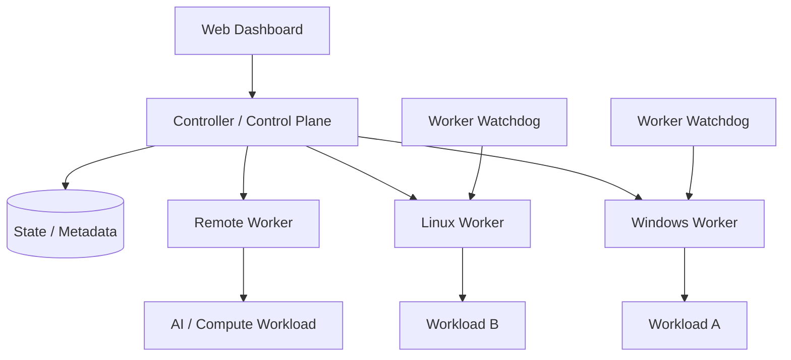

# ClusterForge Architecture

This document describes the current MVP architecture at a high level. It intentionally avoids treating experimental behavior as production guarantees.

## System model

ClusterForge uses a controller/worker model:

## Controller

The controller is the central coordination layer. Its responsibilities include the management view of connected nodes, workload lifecycle operations and scheduling decisions based on reported node state and available resources.

The browser-based dashboard is the operator-facing interface to this control plane.

## Workers / nodes

Workers represent machines that can execute and manage workloads. The MVP targets heterogeneous infrastructure, including Windows and Linux nodes.

Workers report hardware/health information and expose workload operations to the controller. The public `v0.1.0-mvp` release currently publishes the native Windows x86-64 worker/watchdog package.

## Workload lifecycle

The current MVP includes a generic workload lifecycle around operations such as:

- start
- stop
- restart
- status reporting
- log/console reporting
- crash handling

ClusterForge is being extended toward reusable workload definitions, containerized workloads and compute-specific scheduling.

## Scheduling

Resource-aware node selection is part of the current MVP direction. Scheduling uses available node information to choose an appropriate worker rather than treating every machine as identical.

Future work includes stronger CPU/GPU capability detection, queueing, scheduling policies and AI/compute placement.

## Reliability and recovery

ClusterForge includes watchdog processes for service recovery and contains synchronization/failover-related workload lifecycle logic. These capabilities are still part of an MVP and should not be interpreted as production-grade high availability guarantees.

Reliability work remains a major roadmap area, including idempotent operations, improved diagnostics, backup/restore documentation and larger multi-node testing.

## Observability

The project includes hardware/health metrics, workload status and log/console visibility. Future work includes richer historical metrics, diagnostics and audit/observability tooling.

## Build and release pipeline

The public Windows worker build is reproducible through GitHub Actions:

1. reconstruct compact native build source
2. configure and compile the Windows x86-64 binaries
3. run worker/watchdog smoke tests
4. generate SHA-256 checksums
5. package the worker, watchdog, install/uninstall scripts and testing documentation
6. optionally publish a versioned GitHub Release

The build workflow is intentionally part of the repository so the public release process can be inspected.

## Current boundaries

ClusterForge is an early-stage MVP, not a production replacement for Kubernetes, Nomad, Ray or other mature orchestration systems. Its present focus is a lightweight, self-hosted control plane for heterogeneous machines and generic workloads, with AI/compute orchestration as a development direction.

See [ROADMAP.md](../ROADMAP.md) for planned work and [SECURITY.md](../SECURITY.md) for security-reporting guidance.
